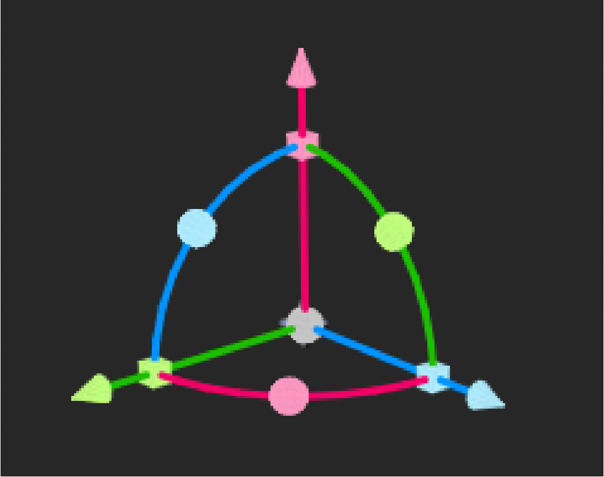
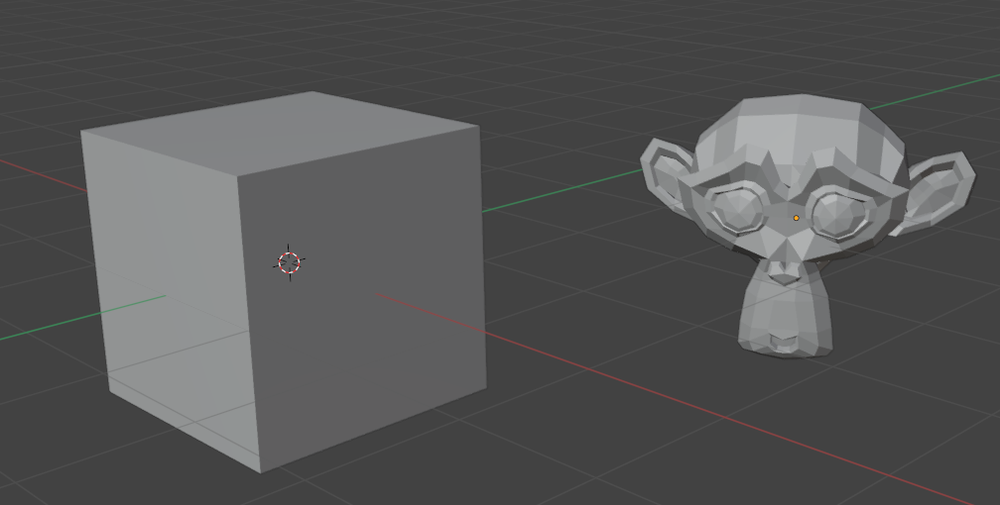

# ビューポートと一覧UIの改善計画

2026-09-10。ユーザーの確認事項を次の実装対象として整理する。現在は計画・調査段階。

## 実装順と完了条件

| 順序 | 項目 | 実装方針 | 完了条件 |
|---|---|---|---|
| 1 | 一覧の説明文を除去 | 複数選択・解除と整列基準をまとめた現在の常設説明を削除する。同じ説明を別の常設ラベルへ移さない。操作機能は維持する | 新旧Prefabの起動経路とも該当説明が出ず、空白領域も残らない |
| 2 | 整列メニューを折り畳む | 今の整列操作位置に `> 整列メニュー` を置く。初期状態は閉じ、展開時は `v 整列メニュー` としてX/Y/Z整列・等間隔の6操作を表示する | 開閉でき、閉じた分だけ一覧の表示領域が広がる。選択数によるボタンの有効条件を維持する |
| 3 | XZ面の透明化 | 色付き面の描画を止め、グリッド線と軸線だけを残す。旧FloorのRendererも点検する。透明度0だけで深度を書き続ける状態を避ける | 上下・斜めからモデルが面に遮られず見える。配置用の数学的y=0平面、接地、スナップは維持する |
| 4 | ギズモの形状改善 | 参考画像の細い軸、控えめな円錐先端、滑らかな四分円、円形ハンドル、小さな中心部を基準にする | 移動・回転・拡縮の役割を判別でき、拡大・縮小しても線や先端が過度に太くならない。見た目を細くしてもクリックしやすさは維持する |
| 5 | 視点追従照明と形状の見やすさ | [調査・導入設計](../../Docs/design_audit/viewport-lighting-study.md)の順で、描画方式確認→斜めの主光と弱い補助光→必要な遮蔽表現を導入する | 視点を回しても立方体の面と車・ナットの凹凸を識別できる。黒つぶれ・白飛び・ちらつき・UIの変色がない |

## 実装対象

- 一覧：`Assets/Scripts/UI/ViewportOutliner.cs` の `EnsureSelectionControls` と `Scroll_Outliner` の余白。`PreparePrefab`、`Assets/Editor/Automation/ApplyAuthoringFeatures.cs`、`BuildUiPrefabs` 経由とruntime補完の両方を更新する。折り畳み状態は表示状態として保持し、教材内容には保存しない。
- 床：`Assets/Scripts/WorkspaceFloorGrid.cs` の `Floor_Surface`、生成済み判定、BuildRevision。面を生成しなくなる場合、現行の「面が存在すること」を前提とする再生成判定も変更する。既存Sceneの床はEditor API経由で対処する。
- ギズモ：`MoveTool`、`TransformGizmoUtility`、`SelectionOutline`、`RotateTool`。線幅・先端サイズは画面上の大きさを基準に調整し、当たり判定の幅は独立させる。色は軸の意味と既存仕様との整合を優先し、参考画像は主に形状・比率の基準とする。回転や拡縮を全モードへ無条件に同時表示する変更は含めない。
- 照明：URP assetのRenderer参照、編集Camera、モデルのmaterial・normal、表示専用照明のライフサイクル。調査文書の未確認項目を実機で確認してから設定値を確定する。

## 見た目の基準

画像はユーザー提供。ギズモの初期試作値は軸線2px前後、先端長10〜14px程度を出発点とし、確定仕様ではなく実画面比較で調整する。視認性の確認は透視／平行投影、近距離／遠距離、背景が明るい／暗い対象で行う。

## 検証・制約

新規取込と保存済みモデル、車全体と個別部品、一覧からの選択、移動・回転・Undo、保存・再読込を回帰確認する。床の下からの観察を必須ケースとし、照明比較は同一モデル・同一視点・同一露出で記録する。

コードと設定の静的確認はCodex、Unityのコンパイル・PlayMode・Player確認はユーザーが行う。GUI操作・Scene/Prefab YAML直接編集・無断の依存追加は行わない。分割読込みの再実装は対象に含めない。回転・着脱教材の残作業は[教材計画](tire-change-authoring-plan.md)に分ける。
