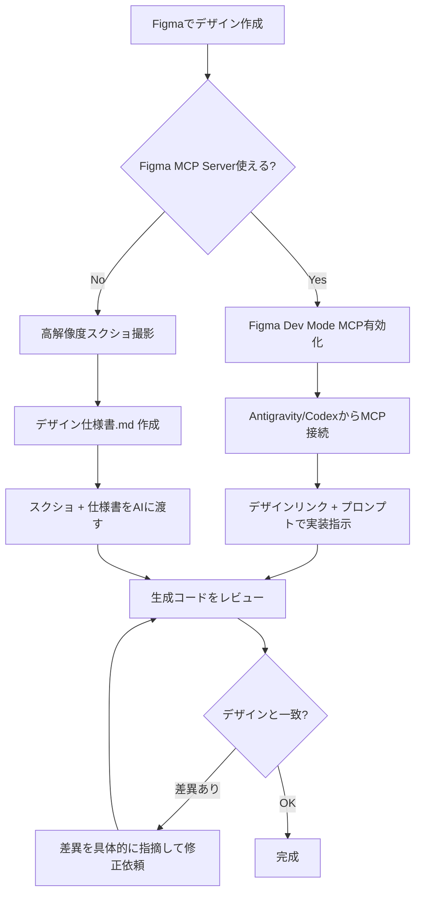
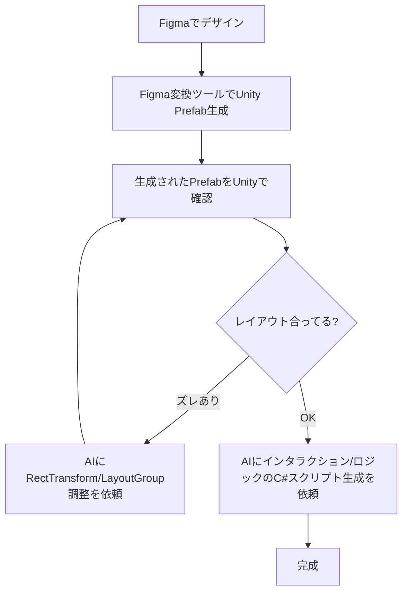

# AIエージェントにFigmaデザインを忠実に実装させる方法

> 調査日: 2026-02-22

## 背景

FigmaのデザインをAIコーディングエージェント（Codex, Antigravityなど）に渡しても、デザインが忠実に再現されない問題が発生している。この文書では、デザインをAIに正確に渡して実装させるためのベストプラクティス・ツール・ワークフローを整理する。

---

## TL;DR（結論まとめ）

| アプローチ | 忠実度 | 使える環境 | おすすめ度 |
|---|---|---|---|
| **Figma MCP Server** + AIエージェント | ★★★★★ | Antigravity, Claude Code, Cursor, Codex CLI | 🥇 最推奨 |
| スクリーンショット + デザイン仕様書 | ★★★☆☆ | すべての環境 | 🥈 MCP使えないとき |
| Figma → デザイントークン export → AI | ★★★★☆ | すべての環境 | 🥈 デザインシステムあるなら |
| Builder.io Visual Copilot | ★★★★☆ | Figma Plugin | ✅ 専用ツールとして |

---

## 1. 最推奨: Figma MCP Server を使う

### 概要

Figma公式の **Dev Mode MCP Server** は、AIエージェントがFigmaファイルの構造化データ（コンポーネント階層、デザイントークン、Auto Layout設定、スタイル等）に直接アクセスできるプロトコル。**スクリーンショットの「見た目」ではなく、設計意図の「構造」を渡せるのが最大の利点。**

### セットアップ手順

#### Step 1: Figma Dev Mode MCP を有効化
1. **Figmaデスクトップアプリ** を開く（ブラウザ版では不可）
2. メニュー → Preferences → **「Enable local MCP server」** にチェック
3. Dev Mode（`Shift + D`）に切り替えて、Inspectパネルで MCP の有効を確認
4. ローカルサーバーが `http://127.0.0.1:3845/mcp` で起動する

> [!IMPORTANT]
> Full seat または Dev seat（Dev Mode付き）のFigmaライセンスが必要。無料プランでは使えない場合がある。

#### Step 2: 各AIエージェントへの接続

##### Antigravity（Gemini）
- MCP Storeから **Figma MCP Server** をインストール
- または手動で MCP設定に以下を追加:
```json
{
  "mcpServers": {
    "figma": {
      "url": "http://127.0.0.1:3845/mcp"
    }
  }
}
```

##### Codex CLI（OpenAI）
- Codex CLIの設定ファイルに MCP サーバーを登録
- Figmaデザインリンクを渡してプロンプト:
```
Build a React component based on this Figma design. 
Use the Figma MCP to get exact design tokens, spacing, and component structure.
Make it pixel-perfect.
```

##### Claude Code（Anthropic）
ターミナルで:
```bash
claude mcp add --transport http figma https://mcp.figma.com/mcp
```
その後 `/mcp` コマンドでFigma認証→プロンプティング。

> [!NOTE]
> Claude Codeは現在ユーザーの利用環境外だが、後述の代替方法で同等の結果は得られる。

##### Cursor
- Settings → Tools & MCP → Figmaサーバーを追加
- または `.cursor/mcp.json` に設定:
```json
{
  "mcpServers": {
    "figma": {
      "url": "http://127.0.0.1:3845/mcp"
    }
  }
}
```

### MCP使用時のプロンプト例

```
Figma MCPを使って以下のデザインのコンポーネント情報を取得し、
忠実に実装してください。

- FigmaファイルURL: [URL]
- 対象フレーム: [フレーム名]
- フレームワーク: React + CSS Modules
- 既存のデザイントークンを使用すること
- スペーシング、フォントサイズ、カラーはすべてFigma上の値に正確に合わせること
```

---

## 2. Figmaファイル側の準備（MCD/スクショ両方に効く）

**AIの精度は「Figmaファイルの構造化度」に直結する。** 以下を徹底するとどのアプローチでも安定して再現度が上がる。

### 必須ベストプラクティス

| カテゴリ | やること | ❌ ダメな例 | ✅ 良い例 |
|---|---|---|---|
| **レイヤー命名** | セマンティックな名前をつける | `Frame 1020391` | `HeroBanner/Title` |
| **Auto Layout** | すべてのフレームに Auto Layout を適用 | 固定座標配置 | gap, padding, alignment 明示 |
| **コンポーネント化** | 再利用要素は Component + Variants で管理 | 毎回コピペ | `Button/Primary/Default`, `Button/Primary/Hover` |
| **デザイントークン** | Figma Variablesでカラー・スペーシング等を管理 | ハードコード `#FF5733` | `var(--color-primary)` |
| **ブレークポイント** | Desktop/Tablet/Mobile を別フレームで用意 | Desktop のみ | `Home/Desktop/1440`, `Home/Mobile/390` |
| **開発者メモ** | フレームの Description にコメント記載 | なし | 「このボタンはForm送信用。disabled時の見た目はVariantで定義」|

---

## 3. スクリーンショット + デザイン仕様書アプローチ

MCP が使えない場合やサクッとやりたい場合の代替手段。

### 手順

1. **高解像度スクリーンショット** をキャプチャ（2x export推奨）
2. **デザイン仕様書（Markdown）** を一緒に渡す
3. プロンプトで「スクリーンショットの通りに」と明示

### デザイン仕様書テンプレート

```markdown
# デザイン仕様: [画面名]

## カラーパレット
- Primary: #FF6B35
- Secondary: #004E89  
- Background: #FAFAFA
- Text: #1A1A2E

## タイポグラフィ
- 見出し: Inter Bold 24px / line-height 1.3
- 本文: Inter Regular 16px / line-height 1.6
- キャプション: Inter Regular 12px

## スペーシング
- セクション間: 48px
- カード内パディング: 24px
- 要素間ギャップ: 16px

## コンポーネント仕様
### ボタン
- 高さ: 44px
- border-radius: 8px
- hover時: opacity 0.9 + translateY(-1px)

## レイアウト
- 最大幅: 1200px
- グリッド: 12カラム、ガター 24px
```

### プロンプト例

```
添付のスクリーンショットとデザイン仕様書に完全に従って実装してください。
- カラー・スペーシング・フォントサイズは仕様書の値を正確に使うこと
- ピクセル単位の完全一致を目指すこと
- レスポンシブ対応は仕様書のブレークポイントに従うこと
```

> [!TIP]
> Antigravityではスクリーンショットをドラッグ&ドロップでチャットに添付できる。Codexでもイメージ入力が可能。

---

## 4. デザインシステム統合アプローチ

既にデザインシステム（トークンファイル等）がある場合、AIにそれを参照させることで一貫した実装を得やすい。

### 手順

1. Figma Variablesまたは外部ツールで**デザイントークンをJSON/CSS Variablesとしてエクスポート**
2. プロジェクトにトークンファイルを配置
3. AIにトークンファイルを参照させつつ実装を指示

```
プロジェクトの src/styles/tokens.css にデザイントークンが定義されています。
新しいコンポーネントはすべてこれらのトークンを使って実装してください。
ハードコードされた値は使わないでください。
```

---

## 5. 専用ツール（MCP以外の選択肢）

| ツール | 特徴 | 対応フレームワーク | 価格 |
|---|---|---|---|
| **Builder.io Visual Copilot** | Figma Plugin。デザインからコード生成。既存コードベースの文脈も理解 | React, Vue, Angular, Svelte, HTML等 | Freeプランあり |
| **Locofy.ai** | Figmaプラグイン。Agent Modeで自律的にコード生成 | React, Next.js, React Native, Flutter等 | Freeプランあり |
| **Anima** | デザインをインタラクティブなプロトタイプへ変換、コード生成 | React, HTML, Vue | Free/有料 |
| **Codia AI** | スクリーンショット/PDF→コード変換にも対応 | 多数 | Free/有料 |
| **screenshot-to-code (OSS)** | GitHub上のOSSツール。スクリーンショットからHTML/Tailwind CSS生成 | HTML, Tailwind | 無料 |

---

## 6. 環境別の対応表

### ✅ 使える環境

| ツール/環境 | Figma MCP | スクショ入力 | デザイン仕様書 | 備考 |
|---|---|---|---|---|
| **Antigravity（Gemini 3.1 Pro等）** | ✅ MCP Store経由 | ✅ 画像ドラッグ&ドロップ | ✅ .md参照 | 最も柔軟 |
| **Antigravity（Claude Opus 4.6）** | ✅ MCP Store経由 | ✅ 画像入力 | ✅ .md参照 | MCP同様に使える |
| **Codex アプリ** | ✅ 設定で追加可能 | ✅ 画像入力対応 | ✅ プロンプトで渡す | MCP連携は要確認 |
| **Codex CLI** | ✅ 設定ファイルで追加 | ⚠️ 限定的 | ✅ ファイル参照 | CLIなのでスクショは扱いにくい |

### ⚠️ 使えない環境でしかできないこと

| 機能 | 必要な環境 | 代替案 |
|---|---|---|
| **Code to Canvas** (コード→Figma逆変換) | Figma + Claude Code | 現状ユーザー環境では利用不可。ただしコード→デザインの需要が低ければ不要 |
| Claude Code のネイティブ `/mcp` コマンド | Claude Code（ターミナル） | Antigravity上のClaude Opus 4.6 + MCP Storeで同等のMCP連携が可能 |

> [!NOTE]
> **Claude Code固有の機能は限定的。** Antigravity経由でClaude Opus 4.6を使えば、Figma MCPに接続して同じワークフローが可能。Claude Code「でしか」できない重要な機能は、Figmaの **Code to Canvas**（コードをFigmaに逆インポートする機能）連携くらい。

---

## 7. 推奨ワークフロー（ユーザー環境に最適化）



### 具体的な手順

1. **Figmaファイルを構造化する**（セクション2のベストプラクティス参照）
2. **Figma MCP Serverを有効化**（Figmaデスクトップアプリの設定）
3. **Antigravityで MCP接続を設定**
4. **実装対象のフレーム**をFigma上で選択
5. **プロンプト**でフレームワーク、スタイル手法、既存コードベースの参照先を明記
6. **生成コードを実際のブラウザで確認**し、Figmaデザインとの差異を具体的にフィードバック
7. **反復的に修正**して精度を上げる

---

## 8. よくある失敗パターンと対策

| 失敗 | 原因 | 対策 |
|---|---|---|
| カラーがずれる | ハードコード値 or AIが勝手に選ぶ | Figma Variablesまたは仕様書でカラーコード明示 |
| スペーシングがバラバラ | Auto Layout未使用 | すべてにAuto Layout適用 + gap/padding仕様を明記 |
| フォントが違う | デザインにカスタムフォント使用 | フォント名・ウェイト・サイズをプロンプトに明記 |
| レイアウト構造が異なる | AIが独自の解釈をする | MCP経由で構造データを渡す or 仕様書でHTML構造を指定 |
| レスポンシブが壊れる | ブレークポイント情報なし | 複数ブレークポイントのフレームを用意 |
| AIが「もっと良い」デザインに変える | AIのデフォルト挙動 | 「デザインを変更しないこと。ピクセル単位で忠実に再現」と明記 |

---

## 9. Unity uGUI の場合：Figma MCPはそのまま使えるか？

> 追記: 2026-02-22

### 結論：**Figma MCP だけではuGUIに直接変換できない**

Figma MCP Serverが提供するデータは **Web技術（CSS, Flexbox, Grid）を前提とした構造情報** であり、Unity uGUIの概念（RectTransform, Anchor, Canvas, LayoutGroup等）には直接マッピングされない。

| Figma MCPが出力する情報 | Web (React/Next.js) | Unity uGUI |
|---|---|---|
| Flexbox方向の Auto Layout | → そのまま `display: flex` | ❌ uGUIには Flexbox がない |
| `gap`, `padding` (px) | → そのまま CSS に適用 | ⚠️ LayoutGroup の spacing に手動変換が必要 |
| カラーコード (#RRGGBB) | → そのまま使える | ⚠️ Unity Color (`0-1` float 値) に変換が必要 |
| フォントサイズ (px) | → そのまま使える | ⚠️ TextMeshPro の設定に変換が必要 |
| コンポーネント階層 | → React コンポーネント構造 | ⚠️ Prefab/GameObject 階層に翻訳が必要 |
| Responsive breakpoints | → CSS media queries | ❌ uGUIには直接の概念がない (Anchor で疑似対応) |

> [!CAUTION]
> **Figma MCP + AIに「uGUIで実装して」と言うだけでは、Web的なコードが生成されるリスクが高い。** Web→uGUI の概念マッピングをAIに教える必要がある。

### uGUI固有の難しさ

uGUIは以下の点でWeb UIと大きく異なり、AIが学習データから「正しい」実装を推測しにくい：

| uGUI特有の概念 | なぜ難しいか |
|---|---|
| **RectTransform** (Anchor, Pivot, Offset) | CSS の position/margin/padding とまったく異なるレイアウトモデル |
| **Canvas Scaler** (Reference Resolution) | レスポンシブの仕組みがWebと根本的に違う |
| **VerticalLayoutGroup / HorizontalLayoutGroup** | Flexbox に似てるが、微妙にパラメータが違う |
| **ContentSizeFitter** | Webの `fit-content` 的だが挙動が異なる |
| **TextMeshPro** | CSS font とは設定体系が全然違う（Material Preset, SDF等） |
| **Image (Sliced Sprite)** | 9-slice はWebの `border-image` に近いが設定方法が異なる |
| **Prefab 構造** | HTMLの再利用可能なコンポーネントとは管理方法が違う |

---

## 10. Unity uGUI向けの現実的なアプローチ

### アプローチ比較

| アプローチ | 忠実度 | 手間 | おすすめ度 |
|---|---|---|---|
| **A: Figma変換ツール + AI微調整** | ★★★★☆ | 中 | 🥇 最推奨 |
| **B: AIに仕様書駆動でuGUIを生成させる** | ★★★☆☆ | 中〜高 | 🥈 変換ツールが合わない時 |
| **C: Figma MCP → 中間仕様 → AI でuGUI生成** | ★★★★☆ | 高 | ✅ 大規模プロジェクト向け |

---

### アプローチ A: Figma変換ツール + AI微調整（最推奨）

既存の **Figma→Unity変換ツール** でレイアウトの骨格を作り、**AIで調整・ロジック追加** するハイブリッド手法。

#### 使えるツール

| ツール | uGUI対応 | 特徴 | 価格 |
|---|---|---|---|
| **Figma Converter for Unity** (D.A. Assets) | ✅ | Prefab生成、TextMeshPro対応、フォント自動DL | Asset Store (有料) |
| **Unity Figma Importer** (cdmvision) | ✅ (UGUIパッケージ) | MonoBehaviourバインド対応、多数のUIコンポーネント対応 | GitHub (無料) |
| **UnityFigmaBridge** (simonoliver) | ✅ | プロトタイプフロー対応、レスポンシブレイアウト対応 | GitHub (無料) |

#### ワークフロー



---

### アプローチ B: AIに仕様書駆動で直接uGUIを生成させる

Figma変換ツールを使わず、**デザイン仕様書をuGUI用語で書いて** AIに直接C#コードやPrefab構造を生成させる。

#### Claude Opus 4.6 Thinking を使う場合のコツ

> [!IMPORTANT]
> **uGUIにはWebの常識が通用しない** ことをAIに繰り返し伝える必要がある。以下のプロンプトパターンが重要。

##### プロンプトテンプレート（uGUI専用）

```
あなたはUnityのuGUI（レガシーUI）に精通したエンジニアです。
以下のデザイン仕様に基づいて、uGUI用のC#セットアップスクリプトを生成してください。

## 重要な制約
- WebのCSS/HTML/Flexbox の概念は使わないでください
- すべてのレイアウトは RectTransform + Anchor + LayoutGroup で実装すること
- テキストは TextMeshProUGUI を使用すること
- カラーは UnityEngine.Color (0-1 float) で指定すること
- 既存のPrefab構造 [Assets/Prefabs/UI/] を参照して、プロジェクトの慣習に合わせること

## 画面仕様: [画面名]

### 階層構造 (GameObject ツリー)
- Canvas (Screen Space - Overlay)
  ├── Header (HorizontalLayoutGroup, spacing: 12)
  │   ├── BackButton (Button + Image, size: 44x44)
  │   └── TitleText (TextMeshProUGUI, "設定", fontSize: 24, bold)
  ├── Content (VerticalLayoutGroup, spacing: 16, padding: 24)
  │   ├── SettingItem_Volume (HorizontalLayoutGroup)
  │   │   ├── Label (TextMeshProUGUI, "音量")
  │   │   └── Slider (Slider, min: 0, max: 1, value: 0.8)
  │   └── SettingItem_Theme (HorizontalLayoutGroup)
  │       ├── Label (TextMeshProUGUI, "テーマ")
  │       └── Dropdown (TMP_Dropdown, options: ["ライト", "ダーク"])
  └── Footer (HorizontalLayoutGroup, childAlignment: MiddleCenter)
      └── SaveButton (Button + Image, text: "保存", size: 200x48)

### カラー定義 (Unity Color: R, G, B, A  0-1)
- Background: (0.96, 0.96, 0.96, 1.0)  // #F5F5F5
- Primary: (1.0, 0.42, 0.21, 1.0)       // #FF6B35
- Text: (0.10, 0.10, 0.18, 1.0)         // #1A1A2E

### フォント
- Asset: Assets/Fonts/NotoSansJP-Regular SDF
- Title: size 24, bold
- Body: size 16, regular

### Anchor/Stretch設定
- Canvas全体: Stretch (0,0) to (1,1)
- Header: Top stretch, height 64
- Content: Middle stretch, padding 24
- Footer: Bottom stretch, height 80
```

##### 差異修正のプロンプト例

```
生成されたUIを確認しました。以下の修正をしてください：

1. Header の BackButton が左端に寄りすぎ → padding left を 16 に
2. SettingItem の Label と Slider の比率がおかしい → 
   Label の flexibleWidth = 0.3, Slider の flexibleWidth = 0.7 に
3. SaveButton の角丸がない → Image に Sprite (RoundedRect_8px) を設定
4. フォントカラーが白になっている → (0.10, 0.10, 0.18, 1.0) に修正

既存コードを修正して、変更箇所のみ出力してください。
```

---

### アプローチ C: Figma MCP → 中間仕様 → AI でuGUI生成

大規模UIで最も精密な方法。**MCPでFigmaの構造データを取得し、それをuGUI用の仕様書に翻訳してから実装** する2段階アプローチ。

#### ワークフロー

```
Step 1: Figma MCPで構造データ取得
  → AIに「このFigmaデータをuGUI用の仕様書に変換して」と依頼

Step 2: 生成されたuGUI仕様書を確認・修正

Step 3: uGUI仕様書に基づいてAIにC#コード生成を依頼
```

#### Step 1 のプロンプト例

```
Figma MCPから以下のフレームのデータを取得してください。
取得したデータを、Unity uGUI用の仕様書フォーマットに変換してください。

変換ルール:
- Auto Layout → VerticalLayoutGroup / HorizontalLayoutGroup に変換
- gap → spacing に変換
- padding → LayoutGroup.padding に変換
- color (#RRGGBB) → Unity Color (R/255, G/255, B/255, 1.0) に変換
- fontSize (px) → TextMeshProUGUI.fontSize に変換
- フレーム階層 → GameObject ツリー構造に変換
- コンポーネント → Prefab候補としてマーク

出力フォーマットはGameObjectツリー形式（上記アプローチBのテンプレート参照）で。
```

---

## 11. uGUI向け：よくある失敗パターンと対策

| 失敗 | 原因 | 対策 |
|---|---|---|
| AIがHTML/CSSを生成する | uGUIの知識不足 / プロンプト不足 | 「WebではなくUnity uGUIで」と**毎回**明記 |
| Anchor設定が全部 (0.5, 0.5) | AIがデフォルト値を使う | 仕様書でAnchor値を明示（stretch: 0,0 to 1,1 等） |
| LayoutGroup の設定がおかしい | Flexboxとの概念差 | spacing, padding, childAlignment を数値で指定 |
| TextMeshPro のフォントが見つからない | SDF Asset未指定 | プロジェクト内の SDF Font Asset パスを明示 |
| カラーが 0-255 で指定される | CSS感覚で書いてしまう | 「Unity Color は 0-1 float」と注意書き |
| Canvas Scaler が未設定 | AIが忘れる | Reference Resolution (1920x1080等) を仕様書に必ず含める |
| Sprite の Sliced モードが未設定 | AIが Image.Type.Simple のまま | 「Image.Type = Sliced, border = X」と明記 |

---

## まとめ

### Web (React/Next.js等) の場合
**Figma MCP Server + Antigravity（またはCodex）の組み合わせが最推奨。** ユーザーの現在の環境で十分に対応可能であり、Claude Code などの外部ツールがなくても問題ない。

### Unity uGUI の場合
**Figma MCPだけでは不十分。** MCPが出力するのはWeb向け構造データであり、uGUIの概念（RectTransform, Anchor, LayoutGroup等）への直接変換はサポートされていない。

**最推奨: Figma変換ツール（Figma Converter for Unity等） + AIでの微調整。**
変換ツールが合わない場合は、**uGUI用語で書いた詳細な仕様書 + Claude Opus 4.6 Thinking** のアプローチが現実的。ただし「WebではなくuGUI」であることをプロンプトで毎回強調し、GameObjectツリー形式で仕様を渡す必要がある。

### 共通して重要なこと
1. **Figma側の準備**（構造化・命名・Auto Layout・デザイントークン）
2. **対象フレームワークに合った形式で情報を渡す**（Webならそのまま / uGUIなら翻訳が必要）
3. **プロンプトで「忠実に」と強く指示する**（AIは勝手にアレンジしがち）
4. **反復的に差異を修正する**（1発で完璧は期待しない）
